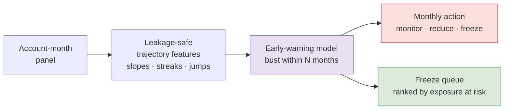
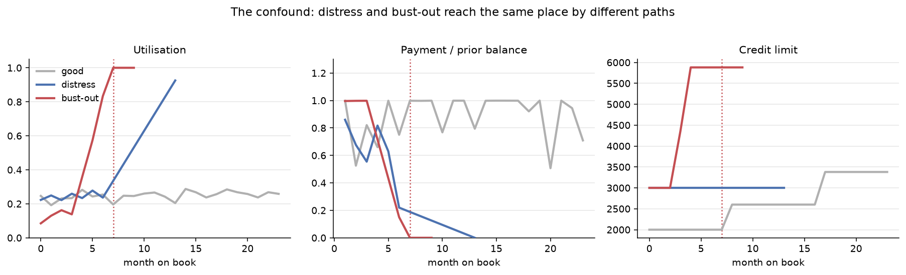
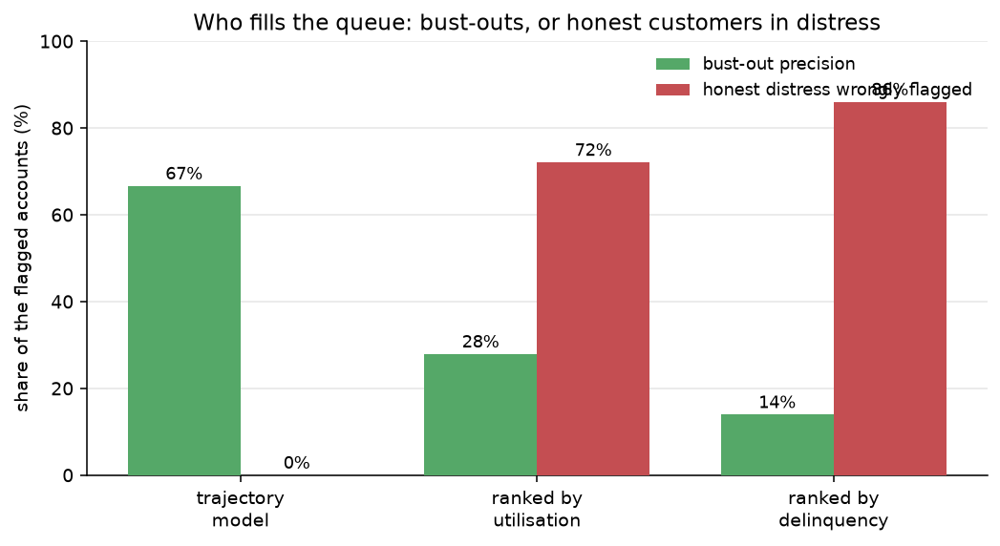
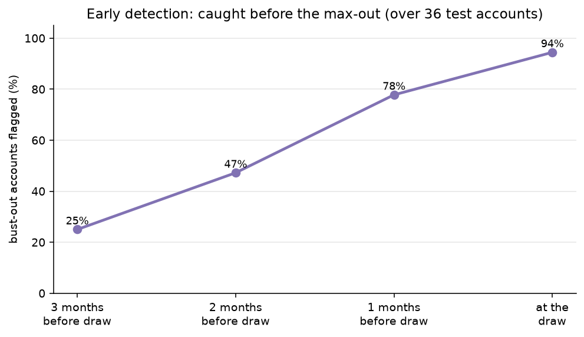
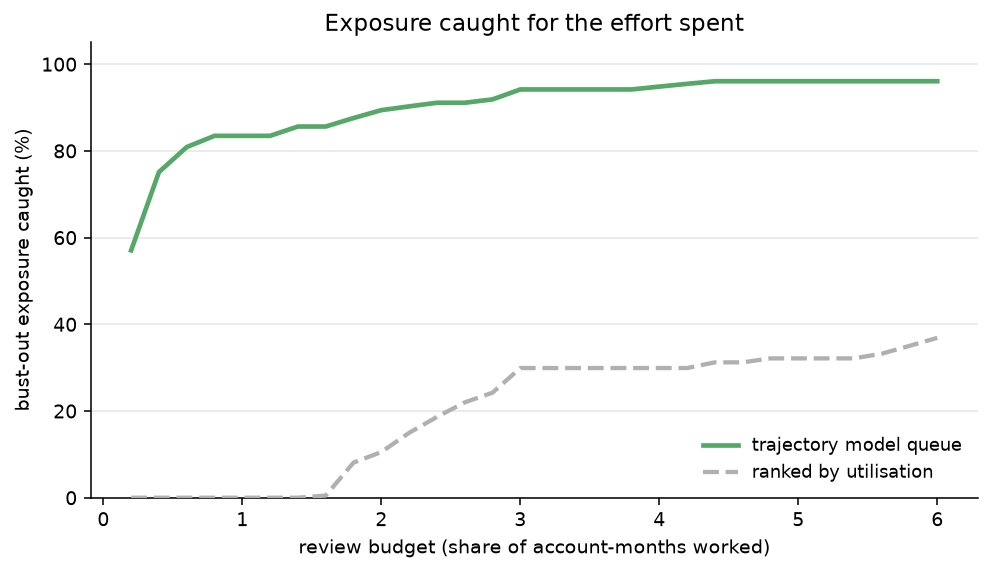

# Bust-Out Detection

Catching a credit line that was cultivated to be drained, while there is still time to stop
it.

Bust-out is first-party fraud in its most expensive form. An account is opened and used
carefully, paid in full, kept at low utilisation, so it earns limit increase after limit
increase and looks like one of the best customers on the book. Then, over a few months, it
ramps: utilisation climbs, payments shift off full, and finally the whole line is drawn at
once, cash is pulled, and the payments simply stop. A point-in-time model never sees it
coming, because until the ramp the account is genuinely excellent. The signal is in the
trajectory, not in any single statement.

The hard part is not spotting a maxed-out, delinquent account. It is telling a bust-out
apart from **genuine financial distress**, which ends in the same place: high utilisation,
minimum payments, delinquency. A model that learns "high utilisation and missed payments"
flags a struggling but genuine customer just as readily as a fraud. This project is built
around that distinction, and its data is built to make the distinction real rather than
trivial.

No lender publishes labelled bust-out data, so the project runs on a schema-faithful
account-month panel that simulates four kinds of account and the way each one moves over
time. Every number here is from that synthetic panel, and the write-up says so.

## How it works



The panel, the leakage-safe features, the early-warning model, the monthly action, and the
cost-ranked freeze queue are all in place; all read the same features. Results are below.

## The four archetypes

The generator (`bustout.panel_data`) simulates a credit line month by month for four kinds
of account, because separating them is the task:

- **good**: moderate utilisation, pays most or all of the balance, occasional limit
  increase, never busts.
- **revolver**: carries a balance at higher utilisation but pays reliably. A confound, so
  that high utilisation on its own is not treated as fraud.
- **distress**: genuine hardship. Utilisation climbs slowly over many months, payments
  taper toward the minimum and below, spend falls as the room runs out, and delinquency
  follows. The account keeps paying something and never spikes.
- **bustout**: cultivated to look excellent, with full payments, low utilisation, and fast
  limit growth, then a multi-month ramp into a full draw of the line, a cash pull, and an
  abrupt stop.

## The confound, and the signal

At the month that matters, utilisation points the wrong way: a distress account sits
**higher** than a bust-out that is still ramping. Levels cannot separate them. The
trajectory can. Mean over the relevant account-months on the mock:

| Feature | Bust-out ramp | Distress | Good |
| --- | --- | --- | --- |
| Utilisation | 0.73 | 0.95 | 0.21 |
| Utilisation slope, 3 months | 0.48 | 0.28 | 0.00 |
| Jump above the account's prior peak | 0.19 | 0.10 | -0.04 |
| Full-payment streak just before | 0.76 | 0.00 | 2.14 |
| Minimum-payment streak | 0.38 | 2.16 | 0.00 |
| Cash-advance share | 0.21 | 0.00 | 0.00 |
| Spend slope, 3 months | +0.10 | -0.05 | +0.01 |
| Limit growth since open | 1.82x | 1.00x | 1.26x |
| Months since last limit increase | 3.1 | 15.9 | 3.9 |

A bust-out ramp climbs fast off a pristine, full-paying history, draws cash, and has grown
its limit quickly and recently. Distress climbs slowly, has paid the minimum for a long
time, draws no cash, and its limit has not moved. Utilisation and delinquency alone would
confuse the two; these features are what tell them apart.

## The features that make it a trajectory

The feature layer (`bustout.features`) turns the panel into signals that describe the path,
not the point:

- **Utilisation dynamics**: the level, its slope over recent months, its acceleration, and
  how far it has jumped above the account's own prior peak.
- **Payment behaviour**: the payment ratio, the length of a recent full-payment streak and
  whether it has just broken, and the length of a minimum-payment streak.
- **Spend and cash**: spend as a share of the limit, its slope, and the share of activity
  that is a cash draw.
- **Limit growth**: how far and how recently the limit has grown, and where utilisation sat
  around the last increase.
- **Delinquency and volatility**: days past due, whether it is rising, and the volatility of
  utilisation.

## Leakage discipline

Every feature for an account at month t uses only that account's statements up to and
including t, because a monthly monitoring model has no access to a later statement. A
feature that reached forward would score well in a notebook and fail in production. The
guard is a test: features computed on a month-prefix of the panel must equal the features
on the full panel for those same rows.

```python
def test_features_use_no_future_info():
    full, cols = features.build_features(panel)
    part, _ = features.build_features(panel[panel["month_index"] <= 10])
    merged = full.merge(part[key + cols], on=key, suffixes=("", "_p"))
    for c in cols:
        assert np.allclose(merged[c], merged[f"{c}_p"], equal_nan=True)
```

The forward label (does the account bust within the horizon) is the one thing allowed to
look ahead, and it is attached separately, never used as a feature.

## How the synthetic panel is built

Because there is no public dataset, the realism of the generator is what makes the results
mean anything. Each account gets an open month, a starting limit, and an archetype, and is
then stepped month by month along an archetype-specific utilisation path, with payments,
purchases, cash draws, limit increases, and delinquency evolving in step. Bust-out accounts
run a pristine cultivation phase, earn fast limit growth, then ramp over several months into
a full draw. Distress accounts climb gradually and pay less and less. The two are made to
share their end state and differ in their path, which is exactly the case the model has to
handle.

## Results

Every figure is from the synthetic panel, evaluated out of time: the panel is split by
statement date at 2024-06, the model trained on earlier months and scored on later ones,
with post-bust charge-off months excluded from both sides.

### The confound is real



A bust-out and a genuinely distressed account arrive at the same place, high utilisation and
missed payments, by different routes. The bust-out (red) stays low while its limit is grown,
then ramps hard and stops paying. Distress (blue) climbs slowly and pays less and less. A
good account (grey) stays flat and pays in full. At the final month the two troubled
accounts look alike; the path does not, and the rising limit gives the bust-out away early.

### Ranking, and who fills the queue

The model ranks the rare label far above the point-in-time baselines (average precision):

| Ranking | Average precision |
| --- | --- |
| Base rate | 0.007 |
| Ranked by delinquency | 0.047 |
| Ranked by utilisation | 0.476 |
| Trajectory model | 0.979 |

The number that matters more is who ends up in the queue. Working the top 1% of scored
account-months:



A queue ranked on utilisation is 72% honest distress, and one ranked on delinquency is 86%;
acting on either means freezing struggling but genuine customers. The trajectory model's
queue is bust-outs, with distress at 0%. This is the case for modelling the path rather than
the point.

### Early enough to act



At the freeze threshold the model catches 94% of bust-outs, 78% of them before the draw,
with a median lead of two months: time enough to freeze or cut the line while the exposure
is still undrawn.

### Exposure caught for the effort



Because the queue ranks by exposure at risk, the undrawn line a bust-out would take, working
just the top 1% of account-months catches effectively all of the bust-out exposure. A
utilisation-ranked queue of the same size catches far less, because it spends the budget on
high-utilisation accounts that are not bust-outs.

These numbers reflect a synthetic panel where the ramp, once it starts, is well defined.
Real bust-out is adversarial and noisier, and the model would need recalibrating on real
outcomes; the result that carries over is that trajectory features separate bust-out from
distress where levels cannot.

## Roadmap

The panel, the leakage-safe features, the model, the freeze queue, and the evaluation above
are all in place. Still to come:

- **Investigation SQL.** Account-level queries over the panel for the trajectory behind a
  flag: an account's utilisation and payment history, the limit increases before a ramp, the
  accounts that maxed out soon after a limit rise.
- **Score calibration.** The model ranks well; before its output is read as a probability
  rather than a rank, it should be calibrated, and that calibration checked over time.

## Limitations

- **Synthetic data.** The generator is faithful to the schema and to how these accounts
  move, not to a real portfolio; real bust-out is adversarial and shifts as controls tighten.
- **The distress boundary is genuinely fuzzy.** Some real accounts sit between hardship and
  fraud, and no model draws that line perfectly; the aim is to separate the clear
  cases and rank the rest by exposure.
- **Cultivation is invisible early.** By construction, the earliest cultivation months carry
  no signal; the model can only act once the ramp begins, which is why lead time is measured
  rather than assumed.

## Run it

```bash
python -m venv .venv && source .venv/bin/activate
pip install -e ".[dev]"
make test            # includes the no-lookahead guard
python run_demo.py   # the panel, the label, and the trajectory separation
python run_model.py  # train, score, and the full evaluation above
```

With no feed present, everything runs on the mock. To score your own book, drop a CSV at
`data/panel.csv` in the format described in [`data/README.md`](data/README.md).

## Repository structure

```
.
├── src/bustout/
│   ├── panel_data.py    # schema-faithful account-month generator + loader
│   ├── features.py      # leakage-safe trajectory features
│   ├── model.py         # time split, scoreable rows, gradient-boosted model
│   ├── scoring.py       # monthly action + exposure-ranked freeze queue + reasons
│   └── metrics.py       # PR-AUC, lead time, exposure at budget, bust-vs-distress separation
├── tests/               # leakage guard, label, generator, model and queue checks
├── scripts/
│   └── make_figures.py  # the README figures
├── run_demo.py          # panel report and the trajectory separation
├── run_model.py         # train, score, and evaluate
├── data/README.md       # input format
└── docs/img/            # figures
```

## Data and licence

The code is released under the MIT License (see `LICENSE`). The panel is generated by this
repository and carries no third-party licence. Raw CSVs are git-ignored.
